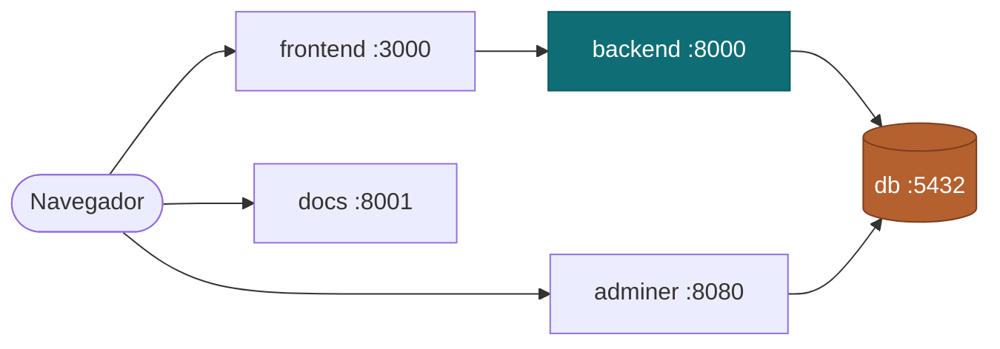

# Ambiente com Docker

O projeto sobe inteiro com **Docker Compose**: banco, backend, frontend e as ferramentas de apoio. Ninguém precisa instalar Postgres, Python ou Node na máquina.

## Serviços

| Serviço | Imagem / Build | Porta | Função |
|---|---|---|---|
| `db` | `postgres:16-alpine` | 5432 | Banco de dados da aplicação |
| `backend` | build de `./backend` | 8000 | API REST |
| `frontend` | build de `./frontend` | 3000 | Interface web |
| `adminer` | `adminer:latest` | 8080 | Cliente web para inspecionar o banco |
| `docs` | `squidfunk/mkdocs-material:9` | 8001 | Esta documentação com live reload |



## Como subir

```bash
cp .env.example .env
docker compose up -d --build
```

| Endereço | O que é |
|---|---|
| <http://localhost:3000> | Frontend |
| <http://localhost:8000> | API |
| <http://localhost:8080> | Adminer |
| <http://localhost:8001> | Documentação |

## Comandos do dia a dia

```bash
docker compose ps                    # status dos containers
docker compose logs -f backend       # acompanhar logs de um serviço
docker compose exec backend bash     # abrir shell no backend
docker compose exec db psql -U tppe  # abrir o psql
docker compose restart backend       # reiniciar um serviço
docker compose down                  # parar tudo (mantém o banco)
docker compose down -v               # parar tudo e apagar o banco
```

!!! warning "Cuidado com o `-v`"
    `docker compose down -v` remove o volume `db-data` e apaga todos os dados do banco local. Use apenas quando quiser recomeçar do zero.

## Variáveis de ambiente

As configurações ficam no arquivo `.env`, criado a partir do `.env.example`. O `.env` não vai para o repositório.

```bash title=".env.example"
# Banco de dados
POSTGRES_DB=tppe
POSTGRES_USER=tppe
POSTGRES_PASSWORD=tppe
DB_PORT=5432

# Backend
BACKEND_PORT=8000
SECRET_KEY=dev-secret-key
DEBUG=1
ALLOWED_HOSTS=localhost,127.0.0.1,backend

# Frontend
FRONTEND_PORT=3000
VITE_API_URL=http://localhost:8000

# Ferramentas
ADMINER_PORT=8080
DOCS_PORT=8001
```

Todas as variáveis têm valor padrão no `docker-compose.yml`, então o projeto sobe mesmo sem `.env`. Os valores acima são de desenvolvimento e não devem ser usados em produção.

## Detalhes de implementação

**Ordem de inicialização.** O `db` tem um `healthcheck` com `pg_isready`. O `backend` usa `depends_on: condition: service_healthy`, então só inicia quando o banco aceita conexões, evitando o erro de conexão recusada na primeira subida.

**Código montado por volume.** `backend` e `frontend` montam o código-fonte do host no container, então alterações aparecem sem rebuild. No frontend, o volume anônimo `/app/node_modules` impede que a pasta do host sobrescreva as dependências instaladas na imagem.

**Persistência.** O volume nomeado `db-data` guarda os dados do Postgres entre reinicializações.

**Rede.** Todos os serviços ficam na rede `tppe` e se enxergam pelo nome. Por isso o backend aponta para `db:5432`, e não para `localhost`.

## Arquivo completo

```yaml title="docker-compose.yml"
name: tppe-grupo3

services:
  db:
    image: postgres:16-alpine
    container_name: tppe-db
    restart: unless-stopped
    environment:
      POSTGRES_DB: ${POSTGRES_DB:-tppe}
      POSTGRES_USER: ${POSTGRES_USER:-tppe}
      POSTGRES_PASSWORD: ${POSTGRES_PASSWORD:-tppe}
    ports:
      - "${DB_PORT:-5432}:5432"
    volumes:
      - db-data:/var/lib/postgresql/data
    healthcheck:
      test: ["CMD-SHELL", "pg_isready -U ${POSTGRES_USER:-tppe} -d ${POSTGRES_DB:-tppe}"]
      interval: 10s
      timeout: 5s
      retries: 5
    networks:
      - tppe

  backend:
    build:
      context: ./backend
      dockerfile: Dockerfile
    container_name: tppe-backend
    restart: unless-stopped
    environment:
      DATABASE_URL: postgresql://${POSTGRES_USER:-tppe}:${POSTGRES_PASSWORD:-tppe}@db:5432/${POSTGRES_DB:-tppe}
      SECRET_KEY: ${SECRET_KEY:-dev-secret-key}
      DEBUG: ${DEBUG:-1}
      ALLOWED_HOSTS: ${ALLOWED_HOSTS:-localhost,127.0.0.1,backend}
    ports:
      - "${BACKEND_PORT:-8000}:8000"
    volumes:
      - ./backend:/app
    depends_on:
      db:
        condition: service_healthy
    networks:
      - tppe

  frontend:
    build:
      context: ./frontend
      dockerfile: Dockerfile
    container_name: tppe-frontend
    restart: unless-stopped
    environment:
      VITE_API_URL: ${VITE_API_URL:-http://localhost:8000}
    ports:
      - "${FRONTEND_PORT:-3000}:3000"
    volumes:
      - ./frontend:/app
      - /app/node_modules
    depends_on:
      - backend
    networks:
      - tppe

  adminer:
    image: adminer:latest
    container_name: tppe-adminer
    restart: unless-stopped
    environment:
      ADMINER_DEFAULT_SERVER: db
    ports:
      - "${ADMINER_PORT:-8080}:8080"
    depends_on:
      db:
        condition: service_healthy
    networks:
      - tppe

  docs:
    image: squidfunk/mkdocs-material:9
    container_name: tppe-docs
    ports:
      - "${DOCS_PORT:-8001}:8000"
    volumes:
      - .:/docs
    networks:
      - tppe

volumes:
  db-data:

networks:
  tppe:
    driver: bridge
```

## Problemas comuns

| Sintoma | Causa provável | Solução |
|---|---|---|
| `port is already allocated` | A porta já está em uso na máquina | Alterar a porta correspondente no `.env` |
| Backend não conecta no banco | Uso de `localhost` no lugar de `db` | Conferir a `DATABASE_URL` |
| Alteração no código não aparece | Volume não montado ou build antigo | `docker compose up -d --build` |
| `node_modules` inconsistente | Dependência nova sem rebuild | `docker compose build --no-cache frontend` |
