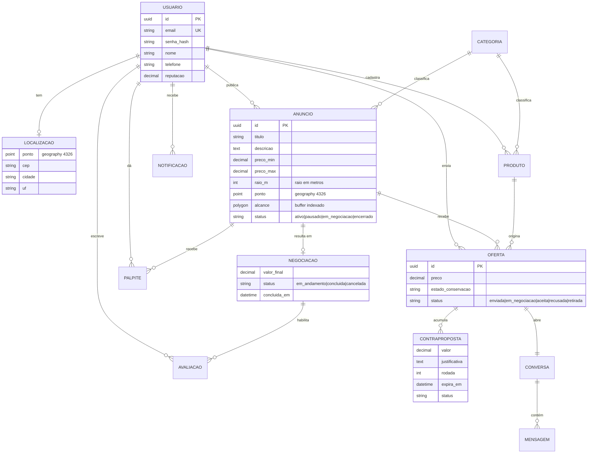

# Backend

API REST em **Python**, com Django e Django REST Framework, sobre PostgreSQL com PostGIS. O backend concentra todas as regras de negócio descritas nas [histórias de usuário](../historias-de-usuario/index.md): o frontend não decide nada sobre estado de anúncio, oferta ou negociação.

## :material-package-variant-closed: Apps por épico

Cada app do Django corresponde a um épico do [backlog](../backlog/index.md), para que a fronteira do código espelhe a fronteira do produto.

| App | Responsabilidade | Épico | Itens |
| :--- | :--- | :--- | :--- |
| `contas` | Usuário, autenticação, perfil e localização de referência | 1 | `QRO-01` a `QRO-03` |
| `anuncios` | Anúncio de "procura-se", ciclo de vida e consulta por raio | 2 | `QRO-04` `QRO-05` |
| `catalogo` | Produtos do vendedor, fotos e status | 3 | `QRO-08` |
| `ofertas` | Envio, edição e retirada de ofertas; busca e filtros | 3 | `QRO-06` `QRO-07` |
| `negociacao` | Palpites, contrapropostas, chat, aceite e conclusão | 5 | `QRO-10` a `QRO-16` |
| `descoberta` | Cálculo de compatibilidade e recomendações | 4 | `QRO-09` |
| `notificacoes` | Eventos, preferências e canais | 6 | `QRO-17` |
| `reputacao` | Avaliações, nota agregada e histórico | 6 | `QRO-18` `QRO-19` |

```
backend/
├── Dockerfile
├── requirements.txt
├── manage.py
└── quero/
    ├── settings/          # base.py, dev.py, prod.py
    ├── urls.py
    ├── core/              # modelos base, permissões, paginação, erros
    ├── contas/
    ├── anuncios/
    ├── catalogo/
    ├── ofertas/
    ├── negociacao/
    ├── descoberta/
    ├── notificacoes/
    └── reputacao/
```

Cada app segue a mesma divisão interna: `models.py`, `serializers.py`, `views.py`, `services.py` e `tests/`. As transições de estado ficam em `services.py`, nunca nas views — é o que permite testá-las sem HTTP.

## :material-database-outline: Modelo de dados



!!! note "Campos que existem por causa de uma regra"
    `alcance` é o buffer pré-calculado do raio, explicado em [Geolocalização](geolocalizacao.md#estrategia-de-indexacao). `rodada` existe por causa do limite de rodadas do [QRO-12](../historias-de-usuario/ofertar-novo-valor.md). Os dados do produto são **copiados** para a oferta no envio, conforme o [RNF-15](../produto/requisitos.md#integridade-e-rastreabilidade).

## :material-api: Contrato da API

Prefixo `/api/v1`. Todas as respostas em JSON, paginadas por cursor nas listagens.

### Conta e acesso

| Método | Rota | Descrição | História |
| :--- | :--- | :--- | :--- |
| `POST` | `/usuarios` | Cria conta | [QRO-01](../historias-de-usuario/cadastrar-se-na-plataforma.md) |
| `POST` | `/sessoes` | Autentica e emite tokens | [QRO-02](../historias-de-usuario/autenticar-se-na-plataforma.md) |
| `DELETE` | `/sessoes` | Encerra a sessão | [QRO-02](../historias-de-usuario/autenticar-se-na-plataforma.md) |
| `POST` | `/sessoes/renovar` | Renova o token de acesso | [QRO-02](../historias-de-usuario/autenticar-se-na-plataforma.md) |
| `POST` | `/senha/redefinir` | Solicita link de redefinição | [QRO-02](../historias-de-usuario/autenticar-se-na-plataforma.md) |
| `GET` `PATCH` | `/perfil` | Lê e altera dados e localização | [QRO-03](../historias-de-usuario/gerenciar-perfil-e-localizacao.md) |

### Anúncios e ofertas

| Método | Rota | Descrição | História |
| :--- | :--- | :--- | :--- |
| `GET` | `/anuncios` | Feed filtrado pelo raio, busca, categoria, preço e distância | [QRO-04](../historias-de-usuario/criar-anuncio-procura-se.md) [QRO-07](../historias-de-usuario/buscar-e-filtrar-anuncios.md) |
| `POST` | `/anuncios` | Publica anúncio de "procura-se" | [QRO-04](../historias-de-usuario/criar-anuncio-procura-se.md) |
| `GET` | `/anuncios/meus` | Anúncios do comprador com status e contagem de ofertas | [QRO-05](../historias-de-usuario/gerenciar-meus-anuncios.md) |
| `PATCH` | `/anuncios/{id}` | Edita, pausa, reativa ou encerra | [QRO-05](../historias-de-usuario/gerenciar-meus-anuncios.md) |
| `GET` `POST` | `/anuncios/{id}/ofertas` | Lista ofertas (só o dono) e envia oferta | [QRO-06](../historias-de-usuario/ofertar-produto-em-anuncio.md) [QRO-11](../historias-de-usuario/comparar-ofertas-recebidas.md) |
| `PATCH` `DELETE` | `/ofertas/{id}` | Edita ou retira a oferta antes do aceite | [QRO-06](../historias-de-usuario/ofertar-produto-em-anuncio.md) |
| `GET` `POST` | `/buscas-salvas` | Salva e reaplica conjuntos de filtros | [QRO-07](../historias-de-usuario/buscar-e-filtrar-anuncios.md) |
| `GET` `POST` | `/produtos` | Catálogo do vendedor | [QRO-08](../historias-de-usuario/cadastrar-produtos-na-loja.md) |

### Negociação

| Método | Rota | Descrição | História |
| :--- | :--- | :--- | :--- |
| `GET` `POST` | `/anuncios/{id}/palpites` | Faixa estimada e envio de palpite | [QRO-10](../historias-de-usuario/palpitar-preco-no-anuncio.md) |
| `POST` | `/ofertas/{id}/contrapropostas` | Envia novo valor | [QRO-12](../historias-de-usuario/ofertar-novo-valor.md) |
| `POST` | `/contrapropostas/{id}/responder` | Aceita, recusa ou contrapõe | [QRO-13](../historias-de-usuario/responder-contraproposta.md) |
| `GET` `POST` | `/ofertas/{id}/mensagens` | Conversa da negociação | [QRO-14](../historias-de-usuario/negociar-por-chat.md) |
| `POST` | `/ofertas/{id}/aceitar` | Aceita e recusa as demais | [QRO-15](../historias-de-usuario/aceitar-ou-recusar-oferta.md) |
| `POST` | `/ofertas/{id}/recusar` | Recusa individual com motivo opcional | [QRO-15](../historias-de-usuario/aceitar-ou-recusar-oferta.md) |
| `POST` | `/negociacoes/{id}/concluir` | Marca conclusão e pede confirmação | [QRO-16](../historias-de-usuario/concluir-venda.md) |
| `POST` | `/negociacoes/{id}/confirmar` | Confirma ou nega a conclusão | [QRO-16](../historias-de-usuario/concluir-venda.md) |

### Descoberta, confiança e histórico

| Método | Rota | Descrição | História |
| :--- | :--- | :--- | :--- |
| `GET` | `/recomendacoes` | Produtos e vendedores compatíveis | [QRO-09](../historias-de-usuario/receber-recomendacoes.md) |
| `POST` | `/recomendacoes/{id}/descartar` | Descarta e alimenta os pesos | [QRO-09](../historias-de-usuario/receber-recomendacoes.md) |
| `GET` | `/notificacoes` | Central de notificações | [QRO-17](../historias-de-usuario/receber-notificacoes.md) |
| `GET` `PUT` | `/notificacoes/preferencias` | Tipos e canais | [QRO-17](../historias-de-usuario/receber-notificacoes.md) |
| `POST` | `/negociacoes/{id}/avaliacao` | Avalia a contraparte | [QRO-18](../historias-de-usuario/avaliar-contraparte.md) |
| `GET` | `/historico` | Negociações concluídas e canceladas | [QRO-19](../historias-de-usuario/historico-de-negociacoes.md) |

## :material-shield-lock-outline: Autenticação e permissões

| Aspecto | Decisão |
| :--- | :--- |
| **Esquema** | JWT com token de acesso curto e token de renovação, via `djangorestframework-simplejwt` |
| **Por quê** | Frontend e API estão em origens diferentes (`:3000` e `:8000`); cookies de sessão exigiriam configuração cruzada em desenvolvimento |
| **Senhas** | `PBKDF2` do Django, atendendo ao [RNF-01](../produto/requisitos.md#seguranca-e-privacidade) |
| **Tentativas** | Bloqueio temporário com `django-axes` ou *throttle* do DRF ([RNF-03](../produto/requisitos.md#seguranca-e-privacidade)) |
| **CORS** | `django-cors-headers`, com origem liberada apenas para o frontend |
| **Autorização** | Permissões por objeto no DRF: o dono do anúncio vê todas as ofertas; o vendedor vê apenas a própria ([RNF-04](../produto/requisitos.md#seguranca-e-privacidade)) |

!!! danger "A regra mais fácil de violar"
    O [RNF-04](../produto/requisitos.md#seguranca-e-privacidade) proíbe um vendedor de ver ofertas concorrentes. Isso não pode depender do frontend esconder a informação: o *queryset* de `/anuncios/{id}/ofertas` precisa ser filtrado pelo papel de quem consulta, e a tarefa [QRO-11.7](../backlog/negociacao.md#qro-11) existe justamente para testar isso.

## :material-clock-fast: Tarefas assíncronas

Conforme a decisão [AD-04](index.md#decisoes-de-arquitetura), estas rotinas começam como verificação preguiçosa na leitura e migram para Celery quando entrarem em produção:

| Rotina | Gatilho | História |
| :--- | :--- | :--- |
| Expirar contraproposta vencida | Prazo | [QRO-12](../historias-de-usuario/ofertar-novo-valor.md) [QRO-13](../historias-de-usuario/responder-contraproposta.md) |
| Confirmar conclusão automaticamente | Prazo sem resposta do comprador | [QRO-16](../historias-de-usuario/concluir-venda.md) |
| Publicar avaliações simultâneas | Ambas enviadas ou prazo vencido | [QRO-18](../historias-de-usuario/avaliar-contraparte.md) |
| Pré-calcular recomendações | Novo anúncio ou novo produto | [QRO-09](../historias-de-usuario/receber-recomendacoes.md) |
| Agrupar e enviar notificações | Evento de domínio | [QRO-17](../historias-de-usuario/receber-notificacoes.md) |

## :material-test-tube: Testes

| Nível | Ferramenta | O que cobre |
| :--- | :--- | :--- |
| **Unidade** | `pytest` + `pytest-django` | Transições de estado em `services.py` |
| **Integração** | `pytest` + banco PostGIS real | Consultas por raio e permissões por objeto |
| **Massa de dados** | `factory_boy` | Anúncios e produtos espalhados geograficamente, espelhando o protótipo |

A *Definition of Done* do [backlog](../backlog/index.md#definition-of-done) exige caminho feliz e ao menos um caminho de erro por item.
