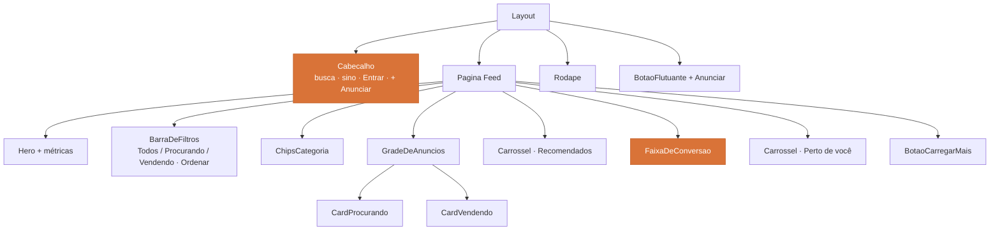

# Frontend

Aplicação de página única em **Vite**, com React e TypeScript, consumindo a API do backend. O ponto de partida é o [protótipo](../interface/prototipo.md): as telas, os componentes e os textos já estão definidos ali.

## :material-file-tree: Estrutura

```
frontend/
├── Dockerfile
├── package.json
├── vite.config.ts
└── src/
    ├── main.tsx
    ├── rotas.tsx
    ├── api/              # cliente HTTP e tipos gerados do contrato
    ├── componentes/
    │   ├── base/         # Botao, Chip, Badge, Campo, Avatar
    │   ├── anuncio/      # CardProcurando, CardVendendo, CardCompacto
    │   ├── feed/         # BarraDeFiltros, ChipsCategoria, Carrossel
    │   └── layout/       # Cabecalho, Rodape, BotaoFlutuante
    ├── paginas/          # uma pasta por rota
    ├── hooks/            # useSessao, useFiltros, useLocalizacao
    ├── estilos/          # tokens.css com a identidade visual
    └── testes/
```

## :material-routes: Rotas

| Rota | Tela | Histórias |
| :--- | :--- | :--- |
| `/` | Feed com hero, filtros, cards e carrosséis | [QRO-04](../historias-de-usuario/criar-anuncio-procura-se.md) [QRO-07](../historias-de-usuario/buscar-e-filtrar-anuncios.md) [QRO-09](../historias-de-usuario/receber-recomendacoes.md) |
| `/entrar` `/cadastrar` | Autenticação e criação de conta | [QRO-01](../historias-de-usuario/cadastrar-se-na-plataforma.md) [QRO-02](../historias-de-usuario/autenticar-se-na-plataforma.md) |
| `/perfil` | Dados cadastrais e localização de referência | [QRO-03](../historias-de-usuario/gerenciar-perfil-e-localizacao.md) |
| `/anunciar` | Formulário de "procura-se" com seletor de raio | [QRO-04](../historias-de-usuario/criar-anuncio-procura-se.md) |
| `/meus-anuncios` | Lista com status e contagem de ofertas | [QRO-05](../historias-de-usuario/gerenciar-meus-anuncios.md) |
| `/anuncios/:id` | Detalhe, ofertas recebidas e comparação | [QRO-11](../historias-de-usuario/comparar-ofertas-recebidas.md) |
| `/anuncios/:id/ofertar` | Envio de oferta, com preenchimento pelo catálogo | [QRO-06](../historias-de-usuario/ofertar-produto-em-anuncio.md) [QRO-08](../historias-de-usuario/cadastrar-produtos-na-loja.md) |
| `/minha-loja` | Catálogo de produtos do vendedor | [QRO-08](../historias-de-usuario/cadastrar-produtos-na-loja.md) |
| `/negociacoes/:id` | Chat, contrapropostas e aceite | [QRO-12](../historias-de-usuario/ofertar-novo-valor.md) [QRO-14](../historias-de-usuario/negociar-por-chat.md) [QRO-15](../historias-de-usuario/aceitar-ou-recusar-oferta.md) |
| `/notificacoes` | Central e preferências | [QRO-17](../historias-de-usuario/receber-notificacoes.md) |
| `/historico` | Negociações concluídas e canceladas | [QRO-19](../historias-de-usuario/historico-de-negociacoes.md) |

## :material-view-dashboard-outline: Composição do feed



## :material-toolbox-outline: Bibliotecas

| Necessidade | Escolha | Motivo |
| :--- | :--- | :--- |
| Roteamento | React Router | Rotas privadas com retorno ao destino original ([QRO-02](../historias-de-usuario/autenticar-se-na-plataforma.md)) |
| Estado de servidor | TanStack Query | Cache, paginação incremental e revalidação do feed |
| Formulários | React Hook Form + Zod | Validação espelhando as regras da API, sem duplicar lógica de negócio |
| Mapa | Leaflet + OpenStreetMap | Pré-visualização da área do raio em KM, sem chave de API |
| Estilos | CSS Modules sobre variáveis CSS | Os mesmos tokens da [identidade visual](../interface/identidade-visual.md) |
| Testes | Vitest + Testing Library | Componentes e fluxos de tela |

## :material-palette-swatch-outline: Tokens compartilhados

A [identidade visual](../interface/identidade-visual.md) vira um único arquivo de variáveis, consumido pela SPA e por esta documentação — a cor da marca é definida em um lugar só.

```css
/* src/estilos/tokens.css */
:root {
  --laranja: #D97338;
  --laranja-hover: #C25F27;
  --laranja-claro: #FBF1EA;
  --sucesso: #34C759;
  --erro: #FF3B30;
  --info: #007AFF;

  --texto-primario: #1A1A1A;
  --texto-secundario: #666666;
  --texto-terciario: #999999;
  --superficie: #F8F8F8;
  --borda: #E8E8E8;

  --fonte-titulo: "Space Grotesk", sans-serif;
  --fonte-corpo: "Inter", sans-serif;

  --raio-card: 12px;
  --raio-botao: 8px;
  --raio-chip: 999px;
  --espaco: 8px;
}
```

## :material-cursor-default-click-outline: Regras de interface

| Regra | Origem |
| :--- | :--- |
| Distâncias sempre em KM, valores sempre em reais | [RNF-18](../produto/requisitos.md#usabilidade-e-interface) |
| Toda listagem tem estado vazio explicando o próximo passo | [RNF-19](../produto/requisitos.md#usabilidade-e-interface) |
| Funciona a partir de 360 px de largura | [RNF-17](../produto/requisitos.md#usabilidade-e-interface) |
| Nenhum estado é sinalizado só por cor | [Identidade visual](../interface/identidade-visual.md) |
| O frontend não decide transição de estado — apenas exibe o que a API retorna | [Backend](backend.md) |

!!! warning "Esconder não é proteger"
    O [RNF-04](../produto/requisitos.md#seguranca-e-privacidade) proíbe um vendedor de ver ofertas concorrentes. O frontend não deve nem receber esses dados: a filtragem é responsabilidade da API. Ocultar na interface é a implementação errada dessa regra.
