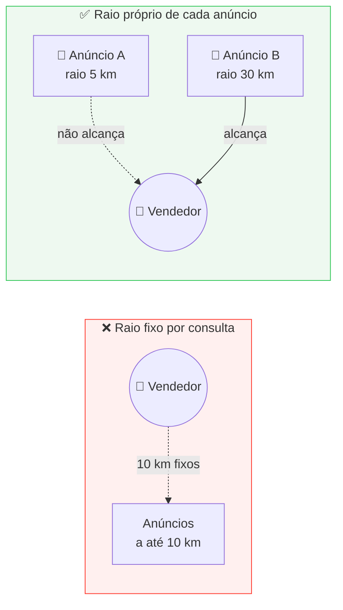

# Geolocalização

O raio de busca em quilômetros não é um detalhe do **Quero.** — é a regra que define quem vê o quê. Esta página descreve como esse raio é modelado, indexado e consultado.

## :material-help-circle-outline: O problema

A consulta parece simples, mas é invertida em relação ao que um marketplace normal faz.

!!! warning "O raio pertence ao anúncio, não a quem busca"
    Em um marketplace tradicional, quem procura define a distância: *"produtos até 10 km de mim"* — um raio fixo por consulta.

    No Quero., **cada anúncio carrega o próprio raio** ([QRO-04](../historias-de-usuario/criar-anuncio-procura-se.md)). A pergunta do vendedor é: *"quais anúncios têm um raio grande o bastante para me alcançar?"* — a distância limite varia linha a linha.



Essa inversão tem uma consequência de desempenho: `ST_DWithin(anuncio.ponto, :ponto_vendedor, anuncio.raio_m)` **não usa o índice espacial**, porque a caixa de busca depende do valor de cada linha. O planejador cai em varredura sequencial, violando o [RNF-09](../produto/requisitos.md#desempenho-e-escala).

## :material-database-cog-outline: Modelagem

| Campo | Tipo | Observação |
| :--- | :--- | :--- |
| `ponto` | `geography(Point, 4326)` | Coordenada do anúncio ou do usuário |
| `raio_m` | `integer` | Raio **em metros**; convertido para KM só na exibição ([RNF-18](../produto/requisitos.md#usabilidade-e-interface)) |
| `alcance` | `geography(Polygon, 4326)` | Área de cobertura pré-calculada — a chave da indexação |

Usamos `geography` em vez de `geometry` porque ela calcula distâncias em **metros sobre o esferoide**, sem projeção intermediária. Para um país do tamanho do Brasil, isso evita escolher um sistema de coordenadas projetado por região e errar a distância entre estados.

```python
# quero/anuncios/models.py
from django.contrib.gis.db import models as gis

class Anuncio(models.Model):
    ponto = gis.PointField(geography=True, srid=4326)
    raio_m = models.PositiveIntegerField(default=20_000)      # 20 km
    alcance = gis.PolygonField(geography=True, srid=4326, editable=False)

    class Meta:
        indexes = [
            gis.Index(fields=["alcance"]),   # GiST
            gis.Index(fields=["ponto"]),
            models.Index(fields=["status", "categoria"]),
        ]
```

## :material-lightning-bolt-outline: Estratégia de indexação

A solução é materializar o raio como polígono no momento da escrita e indexá-lo. A consulta passa a ser uma contenção simples, que o índice GiST resolve.

=== "Recomendado · alcance materializado"

    O `alcance` é gerado sempre que o ponto ou o raio mudarem — o que só acontece ao publicar ou editar o anúncio ([QRO-05](../historias-de-usuario/gerenciar-meus-anuncios.md)).

    ```python
    from django.contrib.gis.db.models.functions import Buffer

    def salvar_alcance(anuncio):
        anuncio.alcance = anuncio.ponto.buffer(anuncio.raio_m)
        anuncio.save(update_fields=["alcance"])
    ```

    ```python
    # Anúncios que alcançam o vendedor — usa o índice GiST em alcance
    Anuncio.objects.filter(
        status="ativo",
        alcance__intersects=vendedor.ponto,
    )
    ```

    | Vantagem | Custo |
    | :--- | :--- |
    | Uma única varredura por índice, independente do número de anúncios | Armazenamento do polígono e recálculo na edição |

=== "Alternativa · pré-filtro por raio máximo"

    Se materializar o polígono for indesejável, define-se um teto de negócio para o raio (por exemplo, 200 km) e filtra-se em duas etapas: a primeira usa o índice com uma distância **constante**, a segunda aplica o raio real de cada linha.

    ```python
    from django.contrib.gis.measure import D

    Anuncio.objects.filter(
        status="ativo",
        ponto__dwithin=(vendedor.ponto, D(km=200)),   # constante → usa índice
    ).filter(
        ponto__distance_lte=(vendedor.ponto, F("raio_m")),  # exato, por linha
    )
    ```

    | Vantagem | Custo |
    | :--- | :--- |
    | Nenhum campo derivado para manter | Exige um teto de raio e faz dois passes |

=== "Descartado · Haversine em Python"

    Calcular a distância na aplicação obriga a trazer todos os anúncios ativos para a memória antes de filtrar. Deixa de funcionar bem antes dos primeiros milhares de registros e inviabiliza ordenar por distância com paginação.

## :material-magnify-scan: As consultas do produto

### Feed do vendedor

Anúncios que alcançam o vendedor, com a distância anotada para exibir nos cards.

```python
from django.contrib.gis.db.models.functions import Distance

Anuncio.objects.filter(
    status="ativo",
    alcance__intersects=vendedor.ponto,
).annotate(
    distancia=Distance("ponto", vendedor.ponto),
).order_by("distancia")
```

Atende [QRO-06](../historias-de-usuario/ofertar-produto-em-anuncio.md) e a ordenação por distância do [QRO-07](../historias-de-usuario/buscar-e-filtrar-anuncios.md).

### Recomendações para o comprador

O sentido oposto: produtos de vendedores que estão **dentro** do raio do anúncio.

```python
Produto.objects.filter(
    status="disponivel",
    vendedor__localizacao__ponto__intersects=anuncio.alcance,
).annotate(
    distancia=Distance("vendedor__localizacao__ponto", anuncio.ponto),
)
```

Atende [QRO-09](../historias-de-usuario/receber-recomendacoes.md), com os demais critérios de compatibilidade — categoria, palavras-chave e faixa de preço — aplicados sobre esse conjunto.

### "Perto de você"

O carrossel do protótipo usa a cidade de referência do usuário, não o raio de nenhum anúncio: um filtro por `cidade` e `uf`, ordenado por distância. É o pré-filtro barato exigido pelo [RNF-09](../produto/requisitos.md#desempenho-e-escala).

## :material-speedometer: Desempenho

| Medida | Efeito |
| :--- | :--- |
| Índice **GiST** em `alcance` e em `ponto` | Transforma varredura sequencial em busca por índice |
| Pré-filtro por `cidade`/`uf` antes do cálculo espacial | Reduz o conjunto candidato em consultas de alto volume |
| Índice composto em `(status, categoria)` | A maioria das consultas já filtra por anúncio ativo |
| Paginação por cursor | Sustenta o **Carregar mais anúncios** sem `OFFSET` crescente |
| `EXPLAIN ANALYZE` no plano de cada consulta espacial | Verificação obrigatória do [RNF-08](../produto/requisitos.md#desempenho-e-escala): 1 s no percentil 95 com 100 mil anúncios |

!!! tip "Massa de dados desde o começo"
    A tarefa [QRO-07.10](../backlog/vendedor.md#qro-07) e o risco de "volume baixo na demonstração" pedem uma *factory* que espalhe anúncios pelas cidades do protótipo — São Paulo, Campinas, Rio de Janeiro, Belo Horizonte e Curitiba. Sem volume real, nenhum problema de plano de consulta aparece antes da entrega.

## :material-cog-outline: O que o PostGIS exige da infraestrutura

| Componente | Necessidade |
| :--- | :--- |
| **Imagem do banco** | `postgis/postgis:16-3.4` — a imagem `postgres:16-alpine` atual **não** tem a extensão |
| **Extensão** | `CREATE EXTENSION postgis;` na primeira migração |
| **Imagem do backend** | Bibliotecas `GEOS`, `GDAL` e `PROJ` instaladas; a imagem `python:3.12-slim` precisa de `binutils libproj-dev gdal-bin` |
| **Backend do Django** | `django.contrib.gis.db.backends.postgis` na `DATABASES` |
| **Geocodificação** | Serviço externo para converter CEP e cidade em coordenadas ([QRO-01.4](../backlog/conta-e-acesso.md#qro-01)) |

Essas mudanças estão consolidadas no [esboço de infraestrutura](infraestrutura.md#o-que-ainda-sera-realizado).
