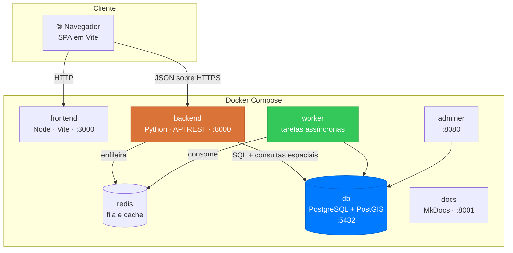

# Arquitetura

Visão geral da arquitetura do **Quero.**: uma API em **Python** sobre **PostgreSQL com PostGIS**, consumida por uma aplicação web em **Vite**. Esta seção descreve as decisões técnicas, o que já está definido e o que ainda será construído.

!!! info "Estado desta seção"
    O repositório hoje contém apenas a documentação. O código do backend e do frontend ainda será criado — o [roadmap técnico](infraestrutura.md#o-que-ainda-sera-realizado) lista o que falta, em ordem de execução.

## :material-layers-outline: Visão em containers



## :material-stack-overflow: Stack

| Camada | Tecnologia | Motivo |
| :--- | :--- | :--- |
| **Banco de dados** | PostgreSQL 16 + **PostGIS 3.4** | O raio de busca em KM é o coração do produto; PostGIS resolve distância e contenção no próprio banco, com índice espacial |
| **Backend** | **Python** com Django + Django REST Framework | O `docker-compose.yml` já pressupõe `SECRET_KEY`, `DEBUG` e `ALLOWED_HOSTS`, que são variáveis de Django |
| **Camada geoespacial** | **GeoDjango** (`django.contrib.gis`) | Integração nativa com PostGIS: `PointField`, `dwithin`, `Distance` — sem SQL manual |
| **Tarefas assíncronas** | Celery + Redis | Expiração de contrapropostas, confirmação automática de venda, pré-cálculo de recomendações e e-mails |
| **Frontend** | **Vite** + React + TypeScript | O `docker-compose.yml` já define `VITE_API_URL`; o protótipo é uma SPA com feed, carrosséis e filtros |
| **Mapa** | Leaflet + OpenStreetMap | Pré-visualização do raio em KM sem chave de API nem custo por requisição |
| **Documentação** | MkDocs Material | Já em uso, publicado no GitHub Pages |

## :material-file-tree: Organização do repositório

O repositório hoje é apenas documentação. A estrutura planejada, coerente com o `docker-compose.yml` existente:

```
docs-grupo3-tppe/
├── backend/            # API em Python — a ser criado
│   ├── Dockerfile
│   ├── requirements.txt
│   └── quero/          # projeto Django + apps por épico
├── frontend/           # SPA em Vite — a ser criado
│   ├── Dockerfile
│   ├── package.json
│   └── src/
├── docs/               # esta documentação
├── docker-compose.yml
└── mkdocs.yml
```

## :material-source-branch: Decisões de arquitetura

Cada decisão registra a alternativa considerada, para que a discussão não precise ser refeita.

=== "AD-01 · PostGIS para o raio"

    **Decisão:** usar PostgreSQL com a extensão PostGIS e o tipo `geography` em SRID 4326.

    **Contexto:** o anúncio de "procura-se" define um raio em KM e só deve ser visível a vendedores dentro dele ([QRO-04](../historias-de-usuario/criar-anuncio-procura-se.md)). Esse é o filtro mais executado da plataforma.

    **Alternativa descartada:** calcular distância em Python com a fórmula de Haversine. Funciona, mas obriga a carregar todos os anúncios na aplicação antes de filtrar, o que quebra o [RNF-08](../produto/requisitos.md#desempenho-e-escala) já com poucos milhares de registros.

    **Consequência:** a imagem do banco precisa ser `postgis/postgis`, e a do backend precisa das bibliotecas GEOS, GDAL e PROJ.

=== "AD-02 · Django em vez de FastAPI"

    **Decisão:** Django + Django REST Framework.

    **Contexto:** o `docker-compose.yml` do projeto já declara `SECRET_KEY`, `DEBUG` e `ALLOWED_HOSTS` — variáveis de Django. Além disso, o GeoDjango é a integração mais madura entre Python e PostGIS, e o admin resolve de graça a moderação prevista em [QRO-14](../historias-de-usuario/negociar-por-chat.md) e [QRO-18](../historias-de-usuario/avaliar-contraparte.md).

    **Alternativa descartada:** FastAPI com SQLAlchemy e GeoAlchemy2. É mais leve e assíncrono por padrão, mas exigiria construir manualmente autenticação, permissões, admin e migrações espaciais.

    **Consequência:** o projeto adota o ORM do Django como fronteira de dados; consultas espaciais complexas podem cair em SQL bruto quando necessário.

=== "AD-03 · Vite + React"

    **Decisão:** SPA em Vite com React e TypeScript.

    **Contexto:** o `VITE_API_URL` já está no compose. O protótipo tem feed paginado, carrosséis, filtros combináveis e estado de sessão — todos os componentes se repetem entre telas.

    **Alternativa descartada:** Vue, igualmente viável no Vite. A escolha é de familiaridade da equipe, não técnica.

    **Consequência:** os tokens da [identidade visual](../interface/identidade-visual.md) viram variáveis CSS compartilhadas entre a SPA e esta documentação.

=== "AD-04 · Assíncrono só quando necessário"

    **Decisão:** começar com verificação preguiçosa na leitura e introduzir Celery apenas quando o comportamento exigir.

    **Contexto:** contraproposta expira por prazo ([QRO-12](../historias-de-usuario/ofertar-novo-valor.md)) e a conclusão de venda se confirma sozinha ([QRO-16](../historias-de-usuario/concluir-venda.md)). Ambos podem ser resolvidos no momento da leitura, comparando datas.

    **Alternativa descartada:** subir Celery e Redis desde a primeira sprint. Adiciona dois serviços antes de existir carga que os justifique.

    **Consequência:** o `worker` e o `redis` entram no compose a partir da Release 3, junto de notificações e recomendações.

## :material-map-outline: Onde continuar

<div class="grid cards" markdown>

-   :material-language-python:{ .lg .middle } **[Backend](backend.md)**

    ---

    Apps, modelo de dados, contrato da API e autenticação.

-   :material-map-marker-radius-outline:{ .lg .middle } **[Geolocalização](geolocalizacao.md)**

    ---

    Como o raio em KM é modelado, indexado e consultado no PostGIS.

-   :material-react:{ .lg .middle } **[Frontend](frontend.md)**

    ---

    Estrutura da SPA, rotas e componentes derivados do protótipo.

-   :material-docker:{ .lg .middle } **[Infraestrutura](infraestrutura.md)**

    ---

    Ambientes, Docker, CI/CD e o esboço do que ainda será realizado.

</div>
