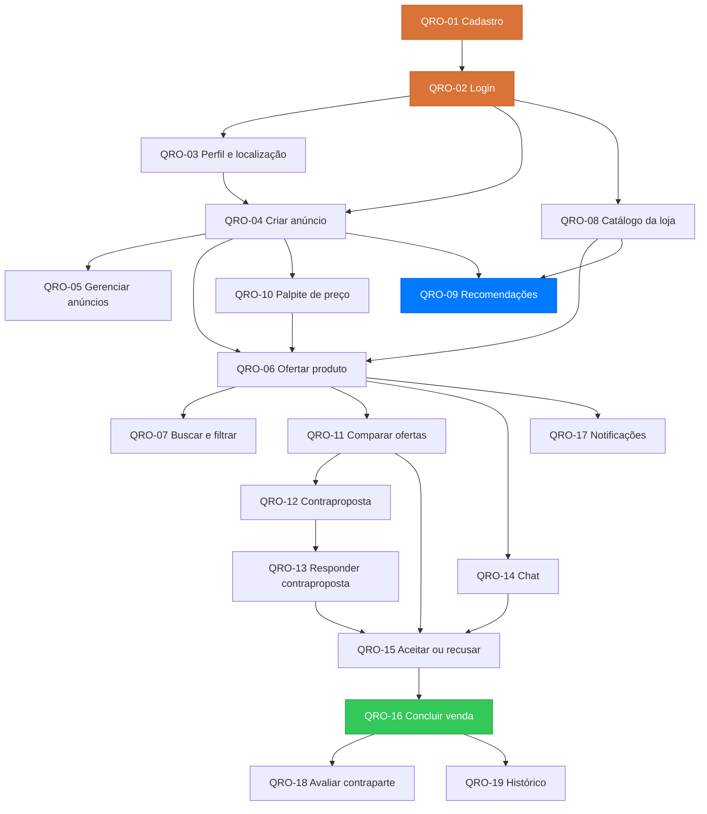

---
hide:
  - navigation
---

# :material-format-list-checks: Backlog do Produto

Backlog do **Quero.**, derivado das [19 histórias de usuário](../historias-de-usuario/index.md). Cada história vira um item de backlog com identificador `QRO-XX`, estimativa em pontos, prioridade, dependências e a lista de tarefas técnicas necessárias para considerá-la pronta.

-   :material-counter:{ .lg .middle } **19 itens**

    ---

    Um por história de usuário, agrupados em 6 épicos.

-   :material-poker-chip:{ .lg .middle } **111 pontos**

    ---

    Estimativa total em escala de Fibonacci.

-   :material-run-fast:{ .lg .middle } **9 sprints**

    ---

    Velocidade planejada de ~13 pontos por sprint.

-   :material-rocket-launch-outline:{ .lg .middle } **3 releases**

    ---

    Fundação, Barganha e Fechamento & Confiança.

## :material-tag-multiple-outline: Convenções

### Identificação

| Elemento | Formato | Exemplo |
| :--- | :--- | :--- |
| **História / item de backlog** | `QRO-XX` | `QRO-04` |
| **Tarefa técnica** | `QRO-XX.N` | `QRO-04.3` |
| **Épico** | Nome da etapa do fluxo | Negociação |

### Escala de estimativa

Fibonacci, em pontos de complexidade relativa — não em horas.

| Pontos | Significado | Referência |
| :--- | :--- | :--- |
| **1** | Trivial, alteração pontual | Ajuste de texto ou validação simples |
| **2** | Pequeno, sem regra nova | Tela somente leitura sobre dado existente |
| **3** | Baixo, uma entidade | [QRO-19 — Histórico](../historias-de-usuario/historico-de-negociacoes.md) |
| **5** | Médio, CRUD com regras | [QRO-01 — Cadastro](../historias-de-usuario/cadastrar-se-na-plataforma.md) |
| **8** | Alto, várias entidades e estados | [QRO-04 — Criar anúncio](../historias-de-usuario/criar-anuncio-procura-se.md) |
| **13** | Muito alto, exige investigação | [QRO-09 — Recomendações](../historias-de-usuario/receber-recomendacoes.md) |

### Priorização (MoSCoW)

| Sigla | Significado | Critério no Quero. |
| :--- | :--- | :--- |
| **M** | *Must have* | Sem ele não existe o fluxo comprador → oferta → venda |
| **S** | *Should have* | Alto valor, mas o fluxo funciona degradado sem ele |
| **C** | *Could have* | Diferencial competitivo, entra se houver folga |
| **W** | *Won't have (agora)* | Consciente e documentado em "Fora de Escopo" das histórias |

### Camadas das tarefas

`Modelagem` · `Backend` · `Frontend` · `Infra` · `QA`

## :material-view-list-outline: Backlog priorizado

| ID | História | Épico | Ator | MoSCoW | Pontos | Sprint | Release |
| :--- | :--- | :--- | :--- | :---: | :---: | :---: | :---: |
| [QRO-01](conta-e-acesso.md#qro-01) | Cadastrar-se na plataforma | Conta e acesso | Visitante | M | 5 | 1 | R1 |
| [QRO-02](conta-e-acesso.md#qro-02) | Autenticar-se na plataforma | Conta e acesso | Usuário | M | 5 | 1 | R1 |
| [QRO-03](conta-e-acesso.md#qro-03) | Gerenciar perfil e localização | Conta e acesso | Usuário | S | 3 | 2 | R1 |
| [QRO-04](comprador.md#qro-04) | Criar anúncio de "procura-se" | Comprador | Comprador | M | 8 | 2 | R1 |
| [QRO-05](comprador.md#qro-05) | Gerenciar meus anúncios | Comprador | Comprador | M | 5 | 3 | R1 |
| [QRO-06](vendedor.md#qro-06) | Ofertar produto em anúncio | Vendedor | Vendedor | M | 8 | 3 | R1 |
| [QRO-07](vendedor.md#qro-07) | Buscar e filtrar anúncios | Vendedor | Vendedor | M | 5 | 4 | R2 |
| [QRO-08](vendedor.md#qro-08) | Cadastrar produtos na minha loja | Vendedor | Vendedor | S | 5 | 4 | R2 |
| [QRO-10](negociacao.md#qro-10) | Palpitar preço no anúncio | Negociação | Vendedor | C | 5 | 4 | R2 |
| [QRO-11](negociacao.md#qro-11) | Comparar ofertas recebidas | Negociação | Comprador | M | 5 | 5 | R2 |
| [QRO-12](negociacao.md#qro-12) | Ofertar um novo valor | Negociação | Comprador | M | 5 | 5 | R2 |
| [QRO-13](negociacao.md#qro-13) | Responder a uma contraproposta | Negociação | Vendedor | M | 5 | 5 | R2 |
| [QRO-14](negociacao.md#qro-14) | Negociar por chat | Negociação | Ambos | M | 8 | 6 | R2 |
| [QRO-15](negociacao.md#qro-15) | Aceitar ou recusar uma oferta | Negociação | Comprador | M | 5 | 6 | R2 |
| [QRO-16](negociacao.md#qro-16) | Concluir a venda | Negociação | Vendedor | M | 5 | 7 | R3 |
| [QRO-17](confianca-e-historico.md#qro-17) | Receber notificações | Confiança | Usuário | S | 8 | 8 | R3 |
| [QRO-18](confianca-e-historico.md#qro-18) | Avaliar a contraparte | Confiança | Ambos | S | 5 | 8 | R3 |
| [QRO-19](confianca-e-historico.md#qro-19) | Histórico de negociações | Confiança | Usuário | C | 3 | 8 | R3 |
| [QRO-09](descoberta.md#qro-09) | Receber recomendações | Descoberta | Comprador | C | 13 | 9 | R3 |

## :material-rocket-launch-outline: Plano de releases

=== "R1 — Fundação e demanda"

    **Sprints 1 a 3 · 34 pontos**

    Entrega o núcleo do modelo reverso: alguém cria conta, publica o que procura e recebe a primeira oferta.

    - `QRO-01` `QRO-02` `QRO-03` `QRO-04` `QRO-05` `QRO-06`

    **Critério de release:** um comprador consegue publicar um anúncio de "procura-se" e um vendedor dentro do raio consegue responder com uma oferta.

=== "R2 — Oferta e barganha"

    **Sprints 4 a 6 · 43 pontos**

    Dá escala ao lado vendedor e implementa a barganha prevista no MVP.

    - `QRO-07` `QRO-08` `QRO-10` `QRO-11` `QRO-12` `QRO-13` `QRO-14` `QRO-15`

    **Critério de release:** o comprador compara ofertas concorrentes, barganha preço e aceita um vendedor.

=== "R3 — Fechamento e confiança"

    **Sprints 7 a 9 · 34 pontos**

    Fecha o ciclo e cria a reputação que sustenta negociações entre desconhecidos.

    - `QRO-16` `QRO-17` `QRO-18` `QRO-19` `QRO-09`

    **Critério de release:** uma negociação vai de anúncio a venda concluída com as duas partes avaliadas.

## :material-chart-timeline-variant: Distribuição por sprint

```mermaid
gantt
    title Roadmap do Quero. por sprint
    dateFormat X
    axisFormat S%d
    section R1 Fundação
    QRO-01 Cadastro           :done,    a1, 1, 1
    QRO-02 Login              :done,    a2, 1, 1
    QRO-03 Perfil             :active,  a3, 2, 1
    QRO-04 Criar anúncio      :active,  a4, 2, 1
    QRO-05 Gerenciar anúncios :         a5, 3, 1
    QRO-06 Ofertar            :         a6, 3, 1
    section R2 Barganha
    QRO-07 Buscar e filtrar   :         b1, 4, 1
    QRO-08 Catálogo           :         b2, 4, 1
    QRO-10 Palpite de preço   :         b3, 4, 1
    QRO-11 Comparar ofertas   :         b4, 5, 1
    QRO-12 Contraproposta     :         b5, 5, 1
    QRO-13 Responder          :         b6, 5, 1
    QRO-14 Chat               :         b7, 6, 1
    QRO-15 Aceitar/recusar    :         b8, 6, 1
    section R3 Confiança
    QRO-16 Concluir venda     :         c1, 7, 1
    QRO-17 Notificações       :         c2, 8, 1
    QRO-18 Avaliação          :         c3, 8, 1
    QRO-19 Histórico          :         c4, 8, 1
    QRO-09 Recomendações      :         c5, 9, 1
```

| Sprint | Itens | Pontos |
| :---: | :--- | :---: |
| **1** | QRO-01, QRO-02 | 10 |
| **2** | QRO-03, QRO-04 | 11 |
| **3** | QRO-05, QRO-06 | 13 |
| **4** | QRO-07, QRO-08, QRO-10 | 15 |
| **5** | QRO-11, QRO-12, QRO-13 | 15 |
| **6** | QRO-14, QRO-15 | 13 |
| **7** | QRO-16 | 5 |
| **8** | QRO-17, QRO-18, QRO-19 | 16 |
| **9** | QRO-09 | 13 |
| | **Total** | **111** |

## :material-check-decagram-outline: Definition of Ready

Um item só entra em sprint quando:

- [ ] Tem história no formato *Como / Eu quero / Para que* publicada nesta documentação.
- [ ] Tem critérios de aceite escritos em *Dado / Quando / Então*.
- [ ] Tem regras de negócio e itens fora de escopo explícitos.
- [ ] Tem estimativa em pontos acordada pela equipe.
- [ ] Tem as dependências (`QRO-XX`) já entregues ou planejadas para a mesma sprint.
- [ ] Tem referência visual no [protótipo](../interface/prototipo.md) quando envolve interface.

## :material-check-all: Definition of Done

Um item só é considerado pronto quando:

- [ ] Todos os critérios de aceite da história passam.
- [ ] As regras de negócio foram implementadas ou registradas como dívida consciente.
- [ ] Existem testes automatizados cobrindo o caminho feliz e ao menos um caminho de erro.
- [ ] O código passou por revisão de outra pessoa da equipe.
- [ ] A interface segue a [identidade visual](../interface/identidade-visual.md) e responde em telas pequenas.
- [ ] A documentação afetada foi atualizada no mesmo *pull request*.

## :material-arrow-decision-outline: Dependências entre os itens

## :material-alert-outline: Riscos do backlog

| Risco | Item afetado | Impacto | Mitigação |
| :--- | :--- | :--- | :--- |
| Algoritmo de match não converge | `QRO-09` | Alto | Versão 1 por regras (categoria + raio + faixa de preço), sem aprendizado de máquina |
| Cálculo de raio com baixa performance | `QRO-04` `QRO-06` `QRO-07` | Médio | Índice geoespacial e pré-filtro por cidade antes do cálculo de distância |
| Chat em tempo real atrasa a sprint | `QRO-14` | Médio | Entregar primeiro por *polling* e só depois evoluir para WebSocket |
| Volume baixo de anúncios na demonstração | `QRO-07` `QRO-09` | Médio | Massa de dados de exemplo espelhando o protótipo |
| Expiração de contraproposta exige agendador | `QRO-12` `QRO-13` | Baixo | Verificação preguiçosa na leitura antes de introduzir job agendado |
