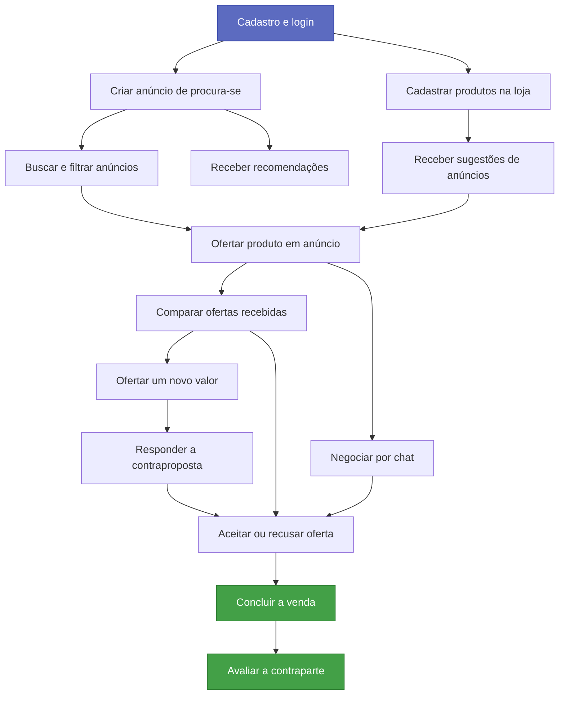

# Histórias de Usuário

Histórias do MVP da **Plataforma de E-Commerce de Usados/Seminovos**, a "OLX reversa" em que o comprador anuncia o que procura e os vendedores respondem com ofertas.

São 20 histórias, agrupadas por etapa do fluxo. Todas seguem o mesmo formato: descrição no padrão *Como / Eu quero / Para que*, contexto, critérios de aceite em *Dado / Quando / Então*, regras de negócio, itens fora de escopo e prioridade.

## Conta e acesso

| História | Ator | Resumo | Prioridade |
|---|---|---|---|
| [Cadastrar-se na plataforma](cadastrar-se-na-plataforma.md) | Visitante | Criar conta com dados e localização | Alta |
| [Autenticar-se na plataforma](autenticar-se-na-plataforma.md) | Usuário | Entrar, sair e recuperar senha | Alta |
| [Gerenciar perfil e localização](gerenciar-perfil-e-localizacao.md) | Usuário | Manter dados e posição atualizados | Média |

## Comprador: publicar a demanda

| História | Ator | Resumo | Prioridade |
|---|---|---|---|
| [Criar anúncio de "procura-se"](criar-anuncio-procura-se.md) | Comprador | Publicar o que deseja, com detalhes e raio em KM | Alta |
| [Gerenciar meus anúncios](gerenciar-meus-anuncios.md) | Comprador | Editar, pausar, reativar e encerrar anúncios | Alta |
| [Receber recomendações](receber-recomendacoes.md) | Comprador | Ver vendedores e produtos compatíveis com a demanda | Média |

## Vendedor: encontrar e ofertar

| História | Ator | Resumo | Prioridade |
|---|---|---|---|
| [Ofertar produto em anúncio](ofertar-produto-em-anuncio.md) | Vendedor | Responder uma demanda compatível com uma oferta | Alta |
| [Buscar e filtrar anúncios](buscar-e-filtrar-anuncios.md) | Vendedor | Achar rápido as demandas que consegue atender | Alta |
| [Receber sugestões de anúncios compatíveis](receber-sugestoes-de-anuncios.md) | Vendedor | Match automático entre catálogo e demandas | Média |
| [Cadastrar produtos na minha loja](cadastrar-produtos-na-loja.md) | Vendedor | Manter catálogo para ofertar em poucos cliques | Média |
| [Divulgar minha loja](divulgar-minha-loja.md) | Vendedor | Página pública com produtos e reputação | Baixa |

## Negociação

| História | Ator | Resumo | Prioridade |
|---|---|---|---|
| [Comparar ofertas recebidas](comparar-ofertas-recebidas.md) | Comprador | Ver e comparar as propostas lado a lado | Alta |
| [Ofertar um novo valor em um anúncio](ofertar-novo-valor.md) | Comprador | Contrapropor o preço pedido pelo vendedor | Alta |
| [Responder a uma contraproposta](responder-contraproposta.md) | Vendedor | Aceitar, recusar ou propor outro valor | Alta |
| [Negociar por chat](negociar-por-chat.md) | Comprador e Vendedor | Combinar detalhes fora do preço | Alta |
| [Aceitar ou recusar uma oferta](aceitar-ou-recusar-oferta.md) | Comprador | Escolher um vendedor e liberar os demais | Alta |
| [Concluir a venda](concluir-venda.md) | Vendedor | Registrar o desfecho e encerrar o anúncio | Alta |

## Confiança e monetização

| História | Ator | Resumo | Prioridade |
|---|---|---|---|
| [Receber notificações](receber-notificacoes.md) | Usuário | Ser avisado dos eventos da negociação | Média |
| [Avaliar a contraparte](avaliar-contraparte.md) | Comprador e Vendedor | Nota e comentário após a venda | Média |
| [Assinar um plano de destaque](assinar-plano-destaque.md) | Vendedor | Visibilidade extra para ofertas e loja | Baixa |

## Dependências entre as histórias

