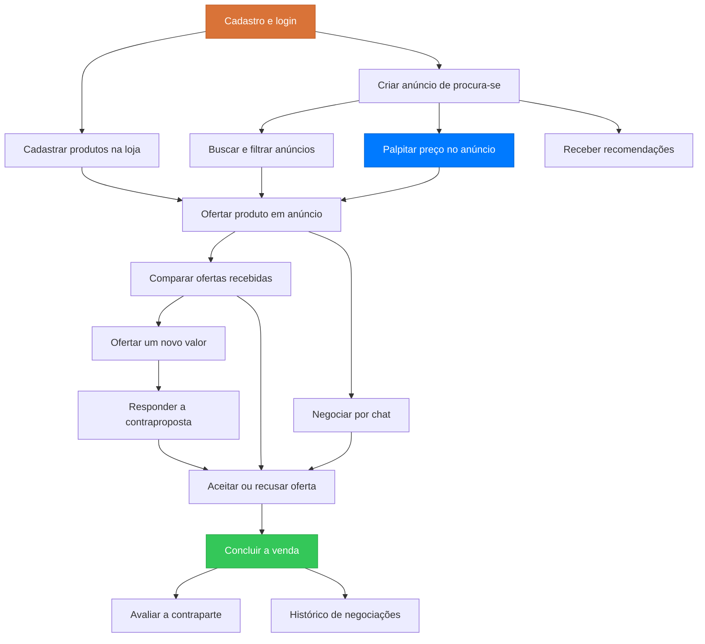

# Histórias de Usuário

As **19 histórias** do MVP do **Quero.**, a plataforma de compras reversa em que o comprador anuncia o que procura e os vendedores respondem com ofertas.

Todas seguem o mesmo formato: descrição no padrão *Como / Eu quero / Para que*, contexto, critérios de aceite em *Dado / Quando / Então*, regras de negócio, itens fora de escopo e prioridade. Cada história tem um identificador `QRO-XX` e um item correspondente no [backlog do produto](../backlog/index.md), com as tarefas técnicas necessárias para entregá-la.

## Conta e acesso

| ID | História | Ator | Resumo | Prioridade |
|---|---|---|---|---|
| QRO-01 | [Cadastrar-se na plataforma](cadastrar-se-na-plataforma.md) | Visitante | Criar conta com dados e localização | Alta |
| QRO-02 | [Autenticar-se na plataforma](autenticar-se-na-plataforma.md) | Usuário | Entrar, sair e recuperar senha | Alta |
| QRO-03 | [Gerenciar perfil e localização](gerenciar-perfil-e-localizacao.md) | Usuário | Manter dados e posição atualizados | Média |

## Comprador: publicar a demanda

| ID | História | Ator | Resumo | Prioridade |
|---|---|---|---|---|
| QRO-04 | [Criar anúncio de "procura-se"](criar-anuncio-procura-se.md) | Comprador | Publicar o que deseja, com detalhes e raio em KM | Alta |
| QRO-05 | [Gerenciar meus anúncios](gerenciar-meus-anuncios.md) | Comprador | Editar, pausar, reativar e encerrar anúncios | Alta |

## Vendedor: encontrar e ofertar

| ID | História | Ator | Resumo | Prioridade |
|---|---|---|---|---|
| QRO-06 | [Ofertar produto em anúncio](ofertar-produto-em-anuncio.md) | Vendedor | Responder uma demanda compatível com uma oferta | Alta |
| QRO-07 | [Buscar e filtrar anúncios](buscar-e-filtrar-anuncios.md) | Vendedor | Achar rápido as demandas que consegue atender | Alta |
| QRO-08 | [Cadastrar produtos na minha loja](cadastrar-produtos-na-loja.md) | Vendedor | Manter catálogo para ofertar em poucos cliques | Média |

## Descoberta e recomendação

| ID | História | Ator | Resumo | Prioridade |
|---|---|---|---|---|
| QRO-09 | [Receber recomendações](receber-recomendacoes.md) | Comprador | Ver vendedores e produtos compatíveis com a demanda | Média |

## Negociação

| ID | História | Ator | Resumo | Prioridade |
|---|---|---|---|---|
| QRO-10 | [Palpitar preço no anúncio](palpitar-preco-no-anuncio.md) | Vendedor | Estimar quanto o produto vale, sem compromisso | Média |
| QRO-11 | [Comparar ofertas recebidas](comparar-ofertas-recebidas.md) | Comprador | Ver e comparar as propostas lado a lado | Alta |
| QRO-12 | [Ofertar um novo valor em um anúncio](ofertar-novo-valor.md) | Comprador | Contrapropor o preço pedido pelo vendedor | Alta |
| QRO-13 | [Responder a uma contraproposta](responder-contraproposta.md) | Vendedor | Aceitar, recusar ou propor outro valor | Alta |
| QRO-14 | [Negociar por chat](negociar-por-chat.md) | Comprador e Vendedor | Combinar detalhes fora do preço | Alta |
| QRO-15 | [Aceitar ou recusar uma oferta](aceitar-ou-recusar-oferta.md) | Comprador | Escolher um vendedor e liberar os demais | Alta |
| QRO-16 | [Concluir a venda](concluir-venda.md) | Vendedor | Registrar o desfecho e encerrar o anúncio | Alta |

## Confiança e histórico

| ID | História | Ator | Resumo | Prioridade |
|---|---|---|---|---|
| QRO-17 | [Receber notificações](receber-notificacoes.md) | Usuário | Ser avisado dos eventos da negociação | Média |
| QRO-18 | [Avaliar a contraparte](avaliar-contraparte.md) | Comprador e Vendedor | Nota e comentário após a venda | Média |
| QRO-19 | [Consultar meu histórico de negociações](historico-de-negociacoes.md) | Usuário | Ver o que já comprou, vendeu e com quem | Baixa |

## Dependências entre as histórias

## Para onde ir depois

-   :material-format-list-checks:{ .lg .middle } **[Backlog do Produto](../backlog/index.md)**

    ---

    As tarefas técnicas, estimativas e sprints de cada uma destas 19 histórias.

-   :material-check-circle-outline:{ .lg .middle } **[Requisitos](../produto/requisitos.md)**

    ---

    Os requisitos funcionais e não funcionais extraídos daqui.

-   :material-cellphone-link:{ .lg .middle } **[Protótipo](../interface/prototipo.md)**

    ---

    Onde cada história aparece na interface do Quero.

