---
hide:
  - navigation
---

# :material-magnify: Quero.

**Plataforma de compras reversa para produtos usados e seminovos.**

Em vez de o vendedor anunciar o que tem à venda, é o **comprador** quem publica um anúncio de *"procura-se"* descrevendo o que deseja, com um raio de busca em quilômetros. São os vendedores próximos que encontram essa demanda e respondem com ofertas.

!!! quote ""
    ### Você anuncia o que quer. Os vendedores te encontram.
    Publique sua demanda gratuitamente e receba ofertas de vendedores próximos a você.

-   :material-flag-outline:{ .lg .middle } **Estado atual**

    ---

    Requisitos, protótipo e arquitetura definidos. Backlog priorizado em 19 itens e 9 sprints; implementação a iniciar.

-   :material-puzzle-outline:{ .lg .middle } **Maior dificuldade**

    ---

    O algoritmo de **match** entre anúncios de "procura-se" e produtos dos vendedores.

-   :material-cash-multiple:{ .lg .middle } **Modelo de ganhos**

    ---

    Links de afiliado, percentual sobre a venda ou assinatura.

## :material-format-list-checks: O MVP

-   :material-magnify:{ .lg .middle } **Comprador**

    ---

    Cria um anúncio de *"procura-se"* com detalhes do produto, faixa de preço e um **raio de busca em KM**.

-   :material-store-outline:{ .lg .middle } **Vendedor**

    ---

    Encontra demandas compatíveis dentro do seu raio, mantém seu catálogo e responde com ofertas.

-   :material-swap-horizontal-bold:{ .lg .middle } **Negociação**

    ---

    Palpite de preço, comparação de ofertas, contraproposta e chat até o acordo entre as partes.

## :material-sitemap-outline: Como funciona o fluxo

```mermaid
flowchart LR
    A(["🧑 Comprador"]) -->|Cria anúncio de<br/>procura-se + raio em KM| B["📢 Anúncio publicado"]
    B -->|Alcança vendedores<br/>dentro do raio| C(["🏪 Vendedor"])
    C -->|Envia oferta com<br/>detalhes do produto| D["💬 Ofertas recebidas"]
    D -->|Comprador compara<br/>e barganha| E["🤝 Negociação"]
    E --> F["✅ Venda concluída"]
    F --> G["⭐ Avaliação mútua"]

    style A fill:#D97338,stroke:#C25F27,color:#fff
    style C fill:#D97338,stroke:#C25F27,color:#fff
    style F fill:#34C759,stroke:#2BA84A,color:#fff
```

!!! tip "Por que compra reversa?"
    Em marketplaces tradicionais o vendedor cria o anúncio e o comprador procura. No **Quero.** a lógica se inverte: **o comprador anuncia a intenção de compra** e o mercado responde a ela. Isso reduz o tempo de busca, expõe demanda que hoje não vira anúncio nenhum e coloca vendedores para concorrer pelo mesmo comprador.

## :material-book-open-page-variant-outline: Navegue pela documentação

-   :material-clipboard-text-outline:{ .lg .middle } **[Histórias de Usuário](historias-de-usuario/index.md)**

    ---

    As **19 histórias** do MVP, do cadastro à avaliação pós-venda, com critérios de aceite, regras de negócio e itens fora de escopo.

-   :material-format-list-checks:{ .lg .middle } **[Backlog do Produto](backlog/index.md)**

    ---

    Os 19 itens `QRO-XX` com tarefas técnicas, estimativas, dependências, releases e roadmap por sprint.

-   :material-check-circle-outline:{ .lg .middle } **[Requisitos](produto/requisitos.md)**

    ---

    40 requisitos funcionais e 23 não funcionais rastreados até a história que os originou.

-   :material-book-alphabet:{ .lg .middle } **[Glossário](produto/glossario.md)**

    ---

    A linguagem única do projeto: papéis, objetos do domínio, estados e termos a evitar.

-   :material-sitemap-outline:{ .lg .middle } **[Arquitetura](arquitetura/index.md)**

    ---

    Backend em Python com Django, PostgreSQL com **PostGIS** para o raio de busca, frontend em Vite e o esboço do que falta construir.

-   :material-palette-outline:{ .lg .middle } **[Identidade visual](interface/identidade-visual.md)**

    ---

    Marca, paleta laranja abóbora, tipografia Space Grotesk / Inter e componentes da interface.

-   :material-cellphone-link:{ .lg .middle } **[Protótipo](interface/prototipo.md)**

    ---

    A tela inicial elemento por elemento, ligada às histórias que cada parte implementa.

-   :material-account-group-outline:{ .lg .middle } **[Equipe](equipe.md)**

    ---

    Quem constrói o Quero. e como o trabalho é organizado.

## :material-numeric: O projeto em números

| | |
| :--- | :--- |
| **Histórias de usuário** | 19, em 6 épicos |
| **Itens de backlog** | 19 (`QRO-01` a `QRO-19`), com 168 tarefas técnicas |
| **Estimativa total** | 111 pontos |
| **Planejamento** | 9 sprints em 3 releases |
| **Requisitos** | 40 funcionais e 23 não funcionais |
| **Stack** | Python · Django · PostgreSQL + PostGIS · Vite |
