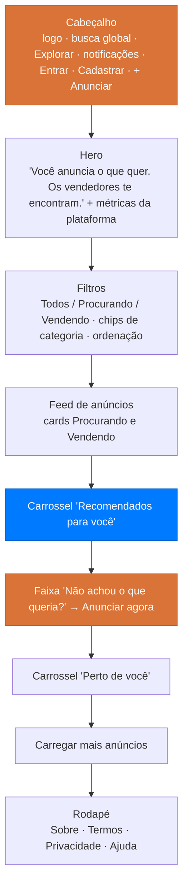

# Protótipo

Registro da tela inicial do **Quero.** e do vínculo entre cada elemento da interface e a história de usuário que ele implementa. O protótipo é a referência visual exigida pela [*Definition of Ready*](../backlog/index.md#definition-of-ready) para itens que envolvem interface.

## :material-application-outline: Estrutura da tela inicial

## :material-link-variant: Elementos e histórias

| Elemento da interface | O que faz | História |
| :--- | :--- | :--- |
| Botão **Cadastrar** | Abre o fluxo de criação de conta | [QRO-01](../historias-de-usuario/cadastrar-se-na-plataforma.md) |
| Botão **Entrar** | Abre o fluxo de autenticação | [QRO-02](../historias-de-usuario/autenticar-se-na-plataforma.md) |
| Cidade de referência em "Perto de você" | Usa a localização do perfil como centro dos cálculos | [QRO-03](../historias-de-usuario/gerenciar-perfil-e-localizacao.md) |
| Botão **+ Anunciar** e botão flutuante | Publica um anúncio de "procura-se" | [QRO-04](../historias-de-usuario/criar-anuncio-procura-se.md) |
| Card **Procurando** | Demanda publicada, com orçamento, cidade, distância e contador de ofertas | [QRO-04](../historias-de-usuario/criar-anuncio-procura-se.md) |
| Contador **N ofertas** no card | Volume de propostas recebidas, ponto de entrada de "Meus anúncios" | [QRO-05](../historias-de-usuario/gerenciar-meus-anuncios.md) |
| Botão **Ofertar** | Envia uma proposta para a demanda | [QRO-06](../historias-de-usuario/ofertar-produto-em-anuncio.md) |
| Barra de busca global | Busca por produto, categoria ou cidade | [QRO-07](../historias-de-usuario/buscar-e-filtrar-anuncios.md) |
| Chips de categoria com contadores | Filtro por categoria | [QRO-07](../historias-de-usuario/buscar-e-filtrar-anuncios.md) |
| Alternador **Todos / Procurando / Vendendo** | Filtro por tipo de anúncio | [QRO-07](../historias-de-usuario/buscar-e-filtrar-anuncios.md) |
| Seletor **Ordenar** | Ordenação da listagem | [QRO-07](../historias-de-usuario/buscar-e-filtrar-anuncios.md) |
| Botão **Carregar mais anúncios** | Paginação incremental do feed | [QRO-07](../historias-de-usuario/buscar-e-filtrar-anuncios.md) |
| Card **Vendendo** com badge de conservação | Produto do catálogo do vendedor exposto no feed | [QRO-08](../historias-de-usuario/cadastrar-produtos-na-loja.md) |
| Carrossel **Recomendados para você** | Match entre anúncio ativo e produtos próximos | [QRO-09](../historias-de-usuario/receber-recomendacoes.md) |
| Carrossel **Perto de você** | Proximidade geográfica como critério de descoberta | [QRO-09](../historias-de-usuario/receber-recomendacoes.md) |
| Faixa **Orçamento R$ x — R$ y** | Faixa de preço desejada, base para palpites e barganha | [QRO-10](../historias-de-usuario/palpitar-preco-no-anuncio.md) |
| Sino de notificações com contador | Central de eventos da negociação | [QRO-17](../historias-de-usuario/receber-notificacoes.md) |
| Reputação **4.8 · 23 av.** no card | Nota agregada das avaliações recebidas | [QRO-18](../historias-de-usuario/avaliar-contraparte.md) |

## :material-card-text-outline: Anatomia dos cards

=== "Card Procurando"

    Demanda publicada pelo comprador. Sem imagem de produto — o produto ainda não existe.

    | Região | Conteúdo |
    | :--- | :--- |
    | Topo | Badge **🛒 Procurando** · badge da categoria · tempo desde a publicação |
    | Corpo | Título da demanda · descrição resumida em até duas linhas |
    | Destaque | Faixa **Orçamento** com os valores mínimo e máximo, em verde de sucesso |
    | Localização | Cidade e UF · distância em KM até o usuário |
    | Rodapé | Avatar e nome do comprador · reputação e número de avaliações · contador de ofertas · botão **Ofertar** |

=== "Card Vendendo"

    Produto do catálogo do vendedor, exposto no feed público.

    | Região | Conteúdo |
    | :--- | :--- |
    | Imagem | Foto do produto com o badge de estado de conservação sobreposto |
    | Topo | Badge **🏷️ Vendendo** · badge da categoria · tempo desde a publicação |
    | Corpo | Título do produto · descrição resumida |
    | Destaque | Preço pedido, em laranja da marca |
    | Metadados | Distância em KM · contador de visualizações |
    | Rodapé | Avatar e nome do vendedor · reputação · botão **Ofertar** |

=== "Card de carrossel"

    Versão compacta usada em "Recomendados para você" e "Perto de você".

    | Região | Conteúdo |
    | :--- | :--- |
    | Imagem | Foto do produto ou ícone de carrinho com o rótulo **Procurando** |
    | Corpo | Título · preço ou faixa de orçamento · distância e cidade |

## :material-text-short: Textos da interface

| Local | Texto |
| :--- | :--- |
| Título do hero | **Você anuncia o que quer. Os vendedores te encontram.** |
| Subtítulo | Publique sua demanda gratuitamente e receba ofertas de vendedores próximos a você. |
| Busca | Buscar por produto, categoria ou cidade... |
| Faixa de conversão | **Não achou o que queria?** Publique sua demanda e deixe os vendedores te encontrarem. É grátis. |
| Seção de proximidade | **Perto de você · <cidade>** — Anúncios na sua cidade para negociar com facilidade |
| Rodapé | © 2026 Quero. Plataforma de compras reversa. |

## :material-alert-decagram-outline: Lacunas entre protótipo e histórias

Diferenças identificadas na varredura. Cada uma é uma decisão pendente, não um defeito do protótipo.

| Lacuna | Situação | Encaminhamento |
| :--- | :--- | :--- |
| Cards **Vendendo** aparecem no feed público | [QRO-08](../historias-de-usuario/cadastrar-produtos-na-loja.md) descreve o catálogo como apoio à oferta, não como vitrine pública | Avaliar se a exposição pública do catálogo entra no MVP ou vira história nova |
| Contador de **visualizações** nos cards | Métricas de visualização estão fora de escopo em [QRO-05](../historias-de-usuario/gerenciar-meus-anuncios.md) | Manter como dado de exibição sem painel de métricas, ou abrir história própria |
| Item **Explorar** no cabeçalho | Nenhuma história descreve uma navegação de exploração separada do feed | Definir se é atalho para o feed filtrado ou funcionalidade distinta |
| Busca global por **cidade** | [QRO-07](../historias-de-usuario/buscar-e-filtrar-anuncios.md) prevê filtro por distância, não busca por cidade arbitrária | Decidir se buscar outra cidade sobrepõe a localização de referência |
| Métricas do hero (anúncios, cidades, vendedores) | Nenhuma história cobre estatísticas públicas da plataforma | Tratar como conteúdo institucional fora do backlog funcional |
| Links **Sobre · Termos · Privacidade · Ajuda** | Páginas institucionais não previstas nas histórias | Conteúdo jurídico e de apoio, fora do backlog do MVP |
